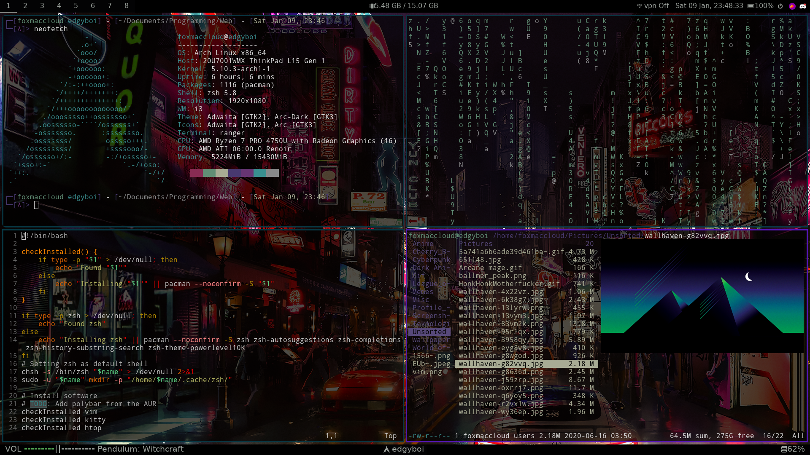

<div align="center">

## Arch-Dotfiles [i3-gaps + Zsh + Polybar]

```
                 ▓█████▄  ▒█████  ▄▄▄█████▓  █████▒██▓ ██▓    ▓█████   ██████                       
                 ▒██▀ ██▌▒██▒  ██▒▓  ██▒ ▓▒▓██   ▒▓██▒▓██▒    ▓█   ▀ ▒██    ▒                       
                 ░██   █▌▒██░  ██▒▒ ▓██░ ▒░▒████ ░▒██▒▒██░    ▒███   ░ ▓██▄                         
                 ░▓█▄   ▌▒██   ██░░ ▓██▓ ░ ░▓█▒  ░░██░▒██░    ▒▓█  ▄   ▒   ██▒                      
                 ░▒████▓ ░ ████▓▒░  ▒██▒ ░ ░▒█░   ░██░░██████▒░▒████▒▒██████▒▒                      
                  ▒▒▓  ▒ ░ ▒░▒░▒░   ▒ ░░    ▒ ░   ░▓  ░ ▒░▓  ░░░ ▒░ ░▒ ▒▓▒ ▒ ░                      
                  ░ ▒  ▒   ░ ▒ ▒░     ░     ░      ▒ ░░ ░ ▒  ░ ░ ░  ░░ ░▒  ░ ░                      
                  ░ ░  ░ ░ ░ ░ ▒    ░       ░ ░    ▒ ░  ░ ░      ░   ░  ░  ░                        
                    ░        ░ ░                   ░      ░  ░   ░  ░      ░                        
                  ░                                                                                 
                                       ▄▄▄▄ ▓██   ██▓                                               
                                      ▓█████▄▒██  ██▒                                               
                                      ▒██▒ ▄██▒██ ██░                                               
                                      ▒██░█▀  ░ ▐██▓░                                               
                                      ░▓█  ▀█▓░ ██▒▓░                                               
                                      ░▒▓███▀▒ ██▒▒▒                                                
                                      ▒░▒   ░▓██ ░▒░                                                
                                       ░    ░▒ ▒ ░░                                                 
                                       ░     ░ ░                                                    
                                            ░░ ░                                                    
  █████▒▒█████  ▒██   ██▒ ███▄ ▄███▓ ▄▄▄       ▄████▄   ▄████▄   ██▓     ▒█████   █    ██ ▓█████▄ 
▓██   ▒▒██▒  ██▒▒▒ █ █ ▒░▓██▒▀█▀ ██▒▒████▄    ▒██▀ ▀█  ▒██▀ ▀█  ▓██▒    ▒██▒  ██▒ ██  ▓██▒▒██▀ ██▌
▒████ ░▒██░  ██▒░░  █   ░▓██    ▓██░▒██  ▀█▄  ▒▓█    ▄ ▒▓█    ▄ ▒██░    ▒██░  ██▒▓██  ▒██░░██   █▌
░▓█▒  ░▒██   ██░ ░ █ █ ▒ ▒██    ▒██ ░██▄▄▄▄██ ▒▓▓▄ ▄██▒▒▓▓▄ ▄██▒▒██░    ▒██   ██░▓▓█  ░██░░▓█▄   ▌
░▒█░   ░ ████▓▒░▒██▒ ▒██▒▒██▒   ░██▒ ▓█   ▓██▒▒ ▓███▀ ░▒ ▓███▀ ░░██████▒░ ████▓▒░▒▒█████▓ ░▒████▓ 
 ▒ ░   ░ ▒░▒░▒░ ▒▒ ░ ░▓ ░░ ▒░   ░  ░ ▒▒   ▓▒█░░ ░▒ ▒  ░░ ░▒ ▒  ░░ ▒░▓  ░░ ▒░▒░▒░ ░▒▓▒ ▒ ▒  ▒▒▓  ▒ 
 ░       ░ ▒ ▒░ ░░   ░▒ ░░  ░      ░  ▒   ▒▒ ░  ░  ▒     ░  ▒   ░ ░ ▒  ░  ░ ▒ ▒░ ░░▒░ ░ ░  ░ ▒  ▒ 
 ░ ░   ░ ░ ░ ▒   ░    ░  ░      ░     ░   ▒   ░        ░          ░ ░   ░ ░ ░ ▒   ░░░ ░ ░  ░ ░  ░ 
           ░ ░   ░    ░         ░         ░  ░░ ░      ░ ░          ░  ░    ░ ░     ░        ░    
                                              ░        ░                                   ░       
```
</div>


Arch Linux configuration made and used by [FoxMaccloud](https://foxmaccloud.com/).

| Distribution   | Arch Linux |
| Window Manager | i3-gaps    |
| Shell          | Zsh        |
| Terminal       | Kitty      |
| Bar            | Polybar    |
| Browser        | FireFox    |
| Editor         | Vim        |
| Video Player   | VLC        |
| Music Player   | Spotify    |
| Image viewer   | feh        |
| Font           | Nerd Fonts |
| Compositor     | Picom      |
| Menu           | Dmenu      |

## Installation

I have tried making an installation script for my configs. It's a work in progress atm, so please report any bugs, features you want added or enhancements.

To install, simply clone the repo
```
git clone https://github.com/FoxMaccloud/Arch-Dotfiles
```
and run the installationscript

Note that the script will need root privileges as it will try to fetch the programs it's missing.
```
chmod +x install.sh
sudo bash install.sh
```
You can also install it manually without the script.


<div align="center">
Made with :heart: by [Fox Maccloud](https://foxmaccloud.com/)
</div>
